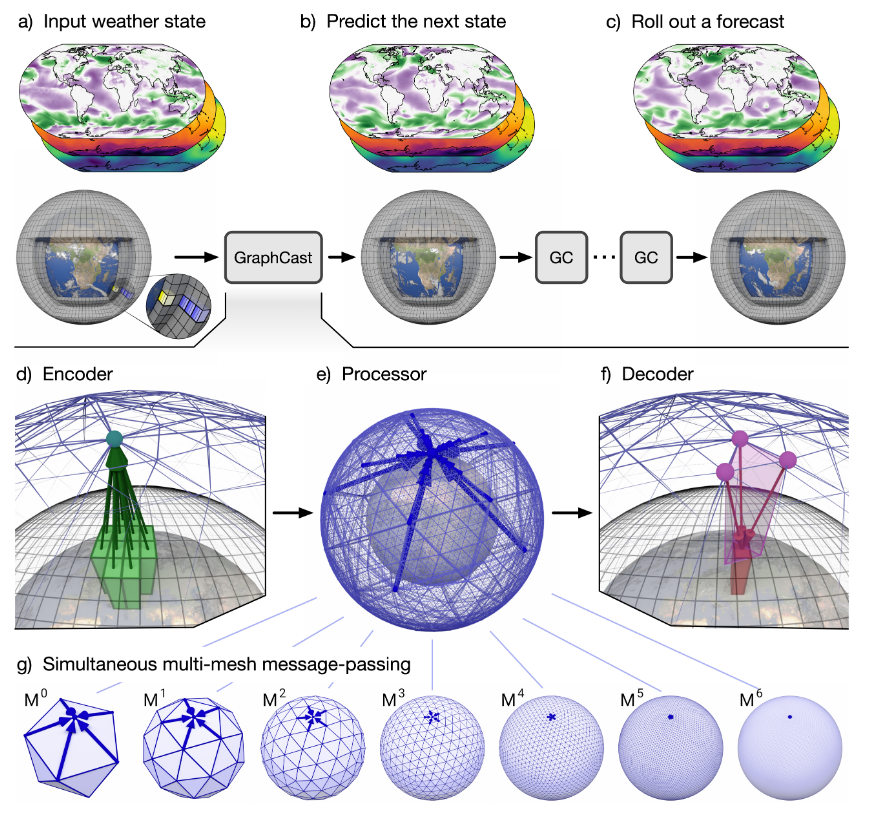
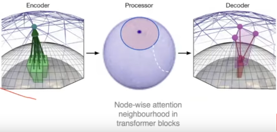

# GenCast - Utilizing Sparse Transformers within Machine Learning Weather Prediction (MLWP)
Price, I., Sanchez-Gonzalez, A., Alet, F. et al. Probabilistic weather forecasting with machine learning. Nature 637, 84–90 (2025). https://doi.org/10.1038/s41586-024-08252-9

## Overview
- Individuals, businesses, and governments around the world use weather predictions to make operational decisions, affecting billions of lives. These weather predictions are produced via **Numerical Weather Prediction (NWP)** wherein supercomputers programmed with the laws of physics and atmospheric chemistry take in observations of current atmospheric conditions and forward model their time evolution over the next 10-15 days.
- Since weather is inherently chaotic, it is impossible to predict the exact weather state of the future. NWP accounts for this by introducing perturbations of initial conditions and sub-resolution phenomena or combining multiple models **to generate an ensemble of weather forecasts, encompassing the probability distribution of future weather**.
  - This distribution becomes narrower for shorter prediction time periods (we are more certain about the weather 1 day from now versus 10 days from now).
  - NWP accuracy scales well with compute but has no ability to learn from past weather.
- **Machine Learning Weather Prediction (MLWP)** has recently emerged using a variety of techniques (Convolutional Neural Networks, Graph Neural Networks, Fourier Neural Operators, and Transformers -- see citations for works). These approaches have not been probalistic in nature, however, usually forecasting the _mean_ of forecast trajectories. **Without the probabilistic nature of the forecast, these methods are less useful for stakeholders.** 
  - Additionally, they tend to "blur" predictions with long lead times (10 days out) as this minimizes the error but it's predictions are not physically real versions of weather.

- GenCast solves these problems by creating ensemble forecasts. It implements a conditional diffusion model which enables easy sampling from the probability distribution of future weather (each forecast has different initial noise that the model starts from, creating an ensemble encompassing the distribution).

## Architecture Overview
- The architecture of GenCast is heavily based on the previous work: GraphCast. It is helpful to have a basic understanding of this. GraphCast consists of a encoder, processor, and decoder elements. The encoder maps input data (temperature, pressure, wind speed etc.) to a mesh. This mesh is comprised of the nodes and edges for an up to 6-times refined icosahedral mesh around the globe. 

Sparse Transformer
- easier to compute (less connections for each node)
- inherently account for geography of earth


 

 


### Question:
Why would a sparse transformer be preferred to a normal transformer?

- Answer: Compute and also physics - Performing attention for every node on all others is a huge load on the model. Additionally, we expect the weather in Nashville to be primarily affected by conditions in our local area e.g. Tennessee, rather than the conditions in Australia for example.


### Pseudocode

This whole process must be parallelized across the mesh (~41k nodes, ~246k edges) and grid (for 0.25 degree resolution, there are 1,038,240 grid nodes).
Forgive my ignorance around graph neural networks.

`n_grid_features = (atmstate-1, atmstate0, forcing-1, forcing0, forcing1, constants)`
- number suffixes indicate timestep. We are attempting to predict the next atmospheric state based on the current one and the one before it: $P(atmstate1 | atmstate0, atmstate-1)$
- atmstate is composed of 6 surface variables + 6 atmospheric variables x 13 pressure levels
- forcings are external factors that influence the weather (solar radiation at the top of the atmosphere, location on globe, time of year (5 factors). These can be computed analytically.
- constants are land-sea mask, surface geopotential and other variables that are known for each grid point.
- Together this becomes a feature dimension of 188 per grid node

For readability, I have made the following notation:
- n = node
- e = edge
- grid = the grid of latitude and longitude cells at 0.25 degree resolution
- mesh = the multimesh composed of an isocahedron 6 times refined with edges across the previous refinements
- features = this is the data in feature space (atmospheric variables)
- embed = this is the data in a latent space (dimension unspecified)

#### Step 0:
Embed grid nodes, mesh nodes, mesh edges, grid to mesh edges, mesh to grid edges into latent space via 5 different MLPs
```
n_grid_embed = MLP0(n_grid_features)
n_mesh_embed = MLP1(n_mesh_features)
e_mesh_embed = MLP2(e_mesh_features)
e_g2m_embed = MLP3(e_g2m_features)
e_m2g_embed = MLP4(e_m2g_features)
```


#### Encoder() - This is a graph neural network
Input:
- e_g2m_embed
- n_grid_embed
- n_mesh_embed
Output:
- The above variables updated based on the information passed from the grid to the mesh
```
# update grid to mesh edges based on adjacent node info with an MLP
1. e_g2m_e_prime = MLP5(e_g2m_embed, n_grid_embed, n_mesh_embed)
# mesh node updated by combining info from all edges arriving at node via MLP
2. n_mesh_e_prime = MLP6(n_mesh_embed, SUM:e_g2m_e_prime)
# grid nodes are also updated
3. n_grid_e_prime = MLP7(n_grid_embed)
# Reassigning + cleaning up
4. n_grid_embed = n_grid_embed + n_grid_e_prime
5. n_mesh_embed = n_mesh_embed + n_mesh_e_prime
6. e_g2m_embed = e_g2m_embed + e_g2m_e_prime
```


#### Processor() - This is a graph transformer model
hyperparameters:
- feature_length = 512 -- this is d_attn in formal algorithms
- khop=32 -- This is the size of the neighborhood of nodes the node in question will attend to
- nheads=4 -- how many self-attention heads would you like in each MHA block?
- n_mhablocks=16 -- how many consecutive MHA blocks would you like?

```
# For demonstration we select one node
n_mesh_embed_0 = n_mesh_embed[0]

# find neighbors for each mesh node to attend to. We do this by finding all nodes
# within khop distance (along e_mesh_embed) from the selected node (n_mesh_embed_0)
# we also add the selected node to the neighborhood so it can attend to itself.
n_mesh_neighborhood = nodes_within(khop*e_mesh_embed(n_mesh_embed_0))
n_mesh_neighborhood += n_mesh_embed_0

# perform mha for each mesh node on itself and its neighborhood
# note: the below triple for loop is only for demonstration - it is parallelized in GenCast
# Note here we take advantage of the notation in Formal Algorithms for Transformers
for b in n_mhablocks:
  for h in nheads:
    for neighbor in n_mesh_neighborhood:
      Y^h = Attention(n_mesh_embed_0, neighbor)
  Y = [Y_neighbor^h...]
  n_mesh_embed_0_prime = W_0 Y + b_0 I^T

```


1. node_features = Grid2MeshGNN(nodenumber, atmstate-1, atmstate-2)

Processor(nodenumber, khop=32, 


## Critical Analysis
- The description of the model architecture is difficult to understand. While it is primarily based on GraphCast, how the Denoiser interacts with the predictions made by the Graph Transformer
- Authors provide ample results from evaluating the accuracy of ensembles (are distributions over/under spread?)

## Impacts
- This work has introduced MLWP as a capable tool for decisionmakers globally. While NWP is still greatly needed, MLWP models such as these can provide rapid cross validation and data to stakeholders around extreme weather events and day-to-day weather.
- One author on both (Ferran Alet) has spoken about how this work has alerted European weather prediction agencies to the power of MLWP and are now investing in GPU infrastructure for this purpose
- Demonstrates the capabilities of Graph Transformer Models 

## Code Demonstration
[Google Colab](https://colab.research.google.com/github/deepmind/graphcast/blob/master/gencast_mini_demo.ipynb)
- I did not make this as it requires usage of Google TPUs for inference
- 

## Resources
- [Ferran Alet speaking on: Graph Neural Networks for Skillful Weather Forecasting](https://youtu.be/ez1pIFcU52s?si=37FJSf73FI5CInzn)
- GenCast arXiv citation:
  - Price, I., Sanchez-Gonzalez, A., Alet, F., Andersson, T. R., El-Kadi, A., Masters, D., Ewalds, T., Stott, J., Mohamed, S., Battaglia, P., Lam, R., & Willson, M. (2023), “GenCast: Diffusion-based ensemble forecasting for medium-range weather”, Nature,  [https://doi.org/10.48550/arXiv.2312.15796](https://doi.org/10.1038/s41586-024-08252-9), arXiv:2312.15796.
- GraphCast Paper:
  - Lam, R., Sanchez-Gonzalez, A., Willson, M., Wirnsberger, P., Fortunato, M., Alet, F., Ravuri, S., Ewalds, T., Eaton-Rosen, Z., Hu, W., Merose, A., Hoyer, S., Holland, G., Vinyals, O., Stott, J., Pritzel, A., Mohamed, S., & Battaglia, P. (2023), “Learning skillful medium-range global weather forecasting”, Science, Volume 382, Issue 6677, pp. 1416-1421 (2023)., 382, 1416-1421 (6 pp),  [https://doi.org/10.1126/science.adi2336](https://doi.org/10.1126/science.adi2336), arXiv:2212.12794.
- Understanding Diffusion Models + tuning them:
  - Karras, T., Aittala, M., Aila, T., & Laine, S. (2022), “Elucidating the Design Space of Diffusion-Based Generative Models”, eprint arXiv:2206.00364, arXiv:2206.00364 ( pp),  [https://doi.org/10.48550/arXiv.2206.00364](https://doi.org/10.48550/arXiv.2206.00364), arXiv:2206.00364.
- [Github Repo for GenCast and GraphCast](https://github.com/google-deepmind/graphcast)
- [Google DeepMind Blog Post about GenCast](https://deepmind.google/discover/blog/gencast-predicts-weather-and-the-risks-of-extreme-conditions-with-sota-accuracy/)
- [ECMWF Reanalysis v5 {ERA5} - the dataset GenCast was trained on](https://www.ecmwf.int/en/forecasts/dataset/ecmwf-reanalysis-v5)
- Other MLWP
  - Transformers: 
    - Bi, K., Xie, L., Zhang, H., Chen, X., Gu, X., & Tian, Q. (2022), “Pangu-Weather: A 3D High-Resolution Model for Fast and Accurate Global Weather Forecast”, eprint arXiv:2211.02556, arXiv:2211.02556 ( pp),  [https://doi.org/10.48550/arXiv.2211.02556](https://doi.org/10.48550/arXiv.2211.02556), arXiv:2211.02556.
    - Nguyen, T., Brandstetter, J., Kapoor, A., Gupta, J. K., & Grover, A. (2023), “ClimaX: A Foundation Model for Weather and Climate”, AGU Fall Meeting 2023, held in San Francisco, CA, 11-15 December 2023, Session: Global Environmental Change / Deep Learning in Climate, Weather, and Earth Sciences I Oral, id. GC21A-01., 2023, GC21A-01 ( pp),  [https://doi.org/10.48550/arXiv.2301.10343](https://doi.org/10.48550/arXiv.2301.10343), arXiv:2301.10343.
    - Chen, K., Han, T., Gong, J., Bai, L., Ling, F., Luo, J.-J., Chen, X., Ma, L., Zhang, T., Su, R., Ci, Y., Li, B., Yang, X., & Ouyang, W. (2023), “FengWu: Pushing the Skillful Global Medium-range Weather Forecast beyond 10 Days Lead”, eprint arXiv:2304.02948, arXiv:2304.02948 ( pp),  [https://doi.org/10.48550/arXiv.2304.02948](https://doi.org/10.48550/arXiv.2304.02948), arXiv:2304.02948.
  - Fourier Neural Operators
    - Pathak, J., Subramanian, S., Harrington, P., Raja, S., Chattopadhyay, A., Mardani, M., Kurth, T., Hall, D., Li, Z., Azizzadenesheli, K., Hassanzadeh, P., Kashinath, K., & Anandkumar, A. (2022), “FourCastNet: A Global Data-driven High-resolution Weather Model using Adaptive Fourier Neural Operators”, eprint arXiv:2202.11214, arXiv:2202.11214 ( pp),  [https://doi.org/10.48550/arXiv.2202.11214](https://doi.org/10.48550/arXiv.2202.11214), arXiv:2202.11214.
  - Graph Neural Networks
    - Keisler, R. (2022), “Forecasting Global Weather with Graph Neural Networks”, eprint arXiv:2202.07575, arXiv:2202.07575 ( pp),  [https://doi.org/10.48550/arXiv.2202.07575](https://doi.org/10.48550/arXiv.2202.07575), arXiv:2202.07575.
  - Convolutional Neural Networks
    - Weyn, J. A., Durran, D. R., &
Caruana, R. (2019). Can machines
learn to predict weather? Using deep
learning to predict gridded 500-hPa
geopotential height from historical
weather data. Journal of Advances
in Modeling Earth Systems, 11,
2680–2693. https://doi.org/10.1029/
2019MS001705
    - Weyn, J. A., Durran, D. R., Caruana, R., & Cresswell-Clay, N. (2021), “Sub-Seasonal Forecasting With a Large Ensemble of Deep-Learning Weather Prediction Models”, Journal of Advances in Modeling Earth Systems, Volume 13, Issue 7, article id. e2021MS002502, 13, e2021MS002502 ( pp),  [https://doi.org/10.1029/2021MS002502](https://doi.org/10.1029/2021MS002502), arXiv:2102.05107.
    - Rasp, S., & Thuerey, N. (2021), “Data Driven Medium Range Weather Prediction With a Resnet Pretrained on Climate Simulations: A New Model for WeatherBench”, Journal of Advances in Modeling Earth Systems, Volume 13, Issue 2, article id. e2020MS002405, 13, e2020MS002405 ( pp),  [https://doi.org/10.1029/2020MS002405](https://doi.org/10.1029/2020MS002405), arXiv:2008.08626.


